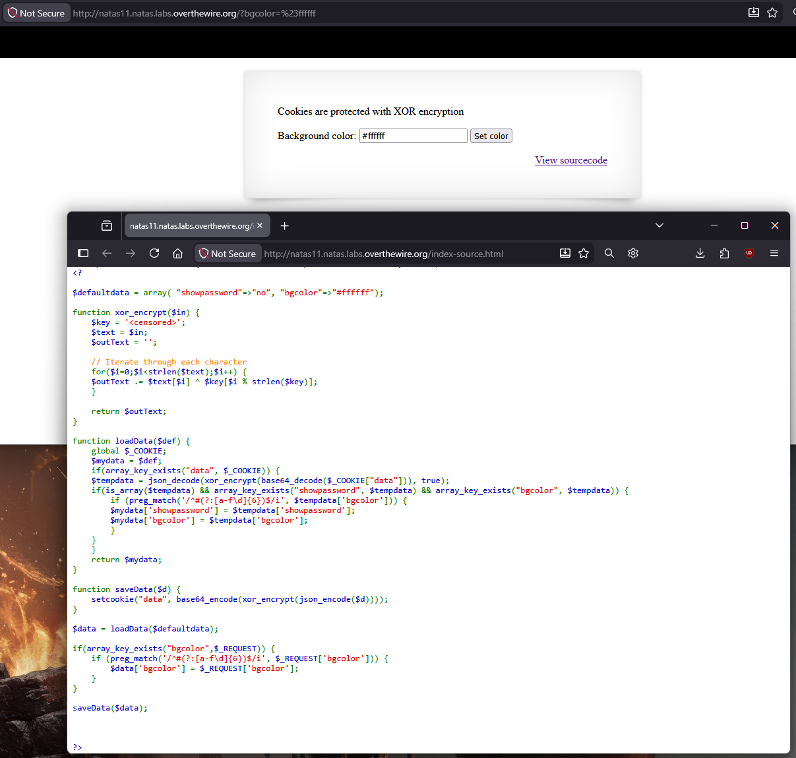
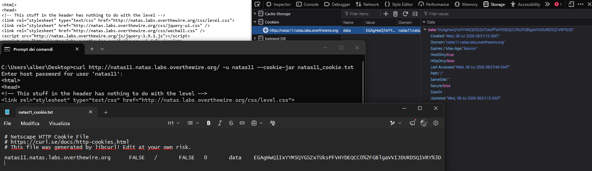
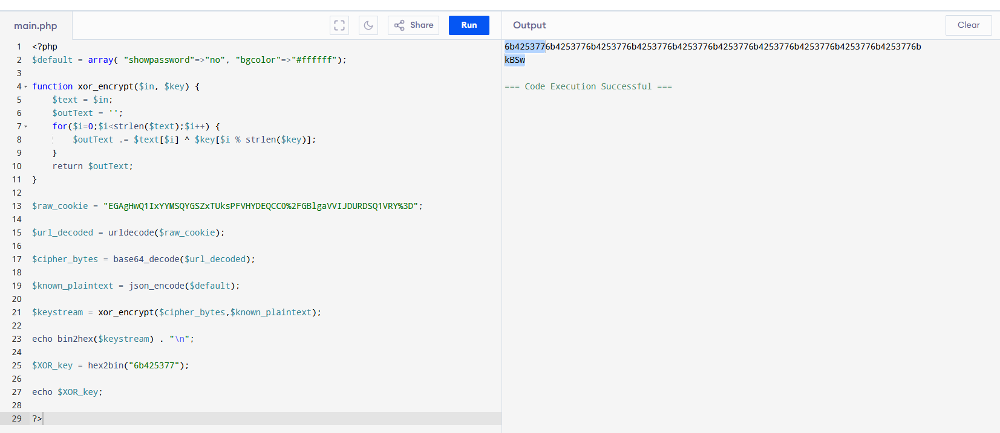
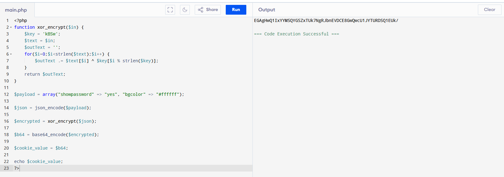
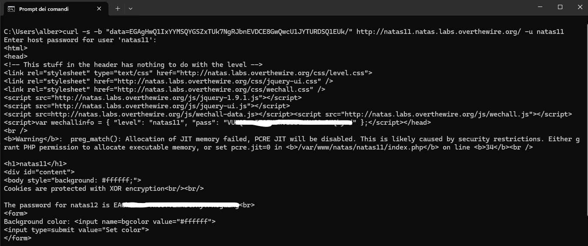

<!-- portfolio-desc: Cifrario XOR a chiave ripetuta e known-plaintext attack per forgiare il cookie di sessione. -->

# Natas Level 11 → 12

## Obiettivo

La pagina mostra un messaggio: "Cookies are protected with XOR encryption", insieme a un campo per impostare il colore di sfondo e un link "View sourcecode". L'obiettivo è capire come il cookie di sessione viene cifrato, risalire alla chiave usata e costruire un cookie contraffatto che forzi la pagina a mostrare la password.

---

## Informazioni di accesso

| Campo | Valore |
|-------|--------|
| URL | `http://natas11.natas.labs.overthewire.org` |
| Username | `natas11` |
| Password | *(password trovata al livello 10)* |

---

## Strumenti / concetti utili

- **Link "View sourcecode"** — espone il codice PHP della pagina
- `^` (operatore XOR bit a bit) — base della funzione di cifratura del livello
- **XOR con chiave ripetuta** — la chiave viene applicata byte per byte e riciclata con l'indice modulo la sua lunghezza
- `base64_encode` / `base64_decode` — codifica/decodifica il testo cifrato per poterlo trasportare in un cookie
- `json_encode` / `json_decode` — serializzano/deserializzano la struttura dati salvata nel cookie
- **DevTools → Storage/Application → Cookies** — permette di leggere il valore del cookie impostato dal server
- `curl -u ... --cookie-jar` / `curl -b` — salvare e reinviare un cookie manualmente da riga di comando
- **Known-plaintext attack** — tecnica per recuperare una chiave di cifratura quando si conosce sia il testo cifrato sia il corrispondente testo in chiaro
- **PHP online compiler** — ambiente per eseguire rapidamente script PHP senza installazione locale

---

## Soluzione

### Step 1 – Analisi del sourcecode e del meccanismo di cifratura

Cliccando "View sourcecode" si legge il codice PHP della pagina:

```php
function xor_encrypt($in) {
    $key = '<censored>';
    $text = $in;
    $outText = '';

    // Iterate through each character
    for($i=0;$i<strlen($text);$i++) {
        $outText .= $text[$i] ^ $key[$i % strlen($key)];
    }

    return $outText;
}

function loadData($def) {
    global $_COOKIE;
    $mydata = $def;
    if(array_key_exists("data", $_COOKIE)) {
        $tempdata = json_decode(xor_encrypt(base64_decode($_COOKIE["data"])), true);
        if(is_array($tempdata) && array_key_exists("showpassword", $tempdata) && array_key_exists("bgcolor", $tempdata)) {
            if (preg_match('/^#(?:[a-f\d]{6})$/i', $tempdata['bgcolor'])) {
                $mydata['showpassword'] = $tempdata['showpassword'];
                $mydata['bgcolor'] = $tempdata['bgcolor'];
            }
        }
    }
    return $mydata;
}

function saveData($d) {
    setcookie("data", base64_encode(xor_encrypt(json_encode($d))));
}

$data = loadData($defaultdata);

if(array_key_exists("bgcolor",$_REQUEST)) {
    if (preg_match('/^#(?:[a-f\d]{6})$/i', $_REQUEST['bgcolor'])) {
        $data['bgcolor'] = $_REQUEST['bgcolor'];
    }
}

saveData($data);
```

```php
<h1>natas11</h1>
<div id="content">
<body style="background: <?=$data['bgcolor']?>;">
Cookies are protected with XOR encryption<br/><br/>

<?
if($data["showpassword"] == "yes") {
    print "The password for natas12 is <censored><br>";
}
?>
```

Il meccanismo è simmetrico: `xor_encrypt()` è un'unica funzione usata sia per cifrare sia per decifrare, perché l'operatore XOR è la propria inversa (`A ^ B ^ B == A`). Il cookie `data` contiene la struttura `{"showpassword": ..., "bgcolor": ...}` prima serializzata in JSON, poi cifrata con `xor_encrypt()` e infine codificata in Base64 per poter viaggiare come valore di cookie. In lettura (`loadData`) il processo è invertito nello stesso ordine: `base64_decode`, poi `xor_encrypt` (che ri-applicando lo XOR con la stessa chiave restituisce il testo in chiaro), poi `json_decode`.

Due dettagli sono decisivi per l'attacco:

1. Il valore di `$key` è mostrato come `<censored>` nel sourcecode: non è leggibile direttamente, va ricavato.
2. `saveData($data)` viene eseguita **sempre**, ad ogni richiesta, indipendentemente dal fatto che un cookie `data` fosse già presente. Questo significa che anche una richiesta GET "pulita", senza alcun cookie inviato, riceve indietro dal server un cookie `data` cifrato con i valori di default (`$defaultdata`), un testo in chiaro che, in questo caso specifico, corrisponde a `showpassword` impostata su `"no"` e `bgcolor` uguale al valore mostrato nel campo "Background color" della pagina (`#ffffff`).

Il filtro `preg_match('/^#(?:[a-f\d]{6})$/i', ...)` in `loadData` è una validazione di formato sul colore (deve essere un `#` seguito da 6 cifre esadecimali): se il `bgcolor` decodificato dal cookie non rispetta questo formato, l'intero blocco `tempdata` viene scartato e `$mydata` resta ai valori di default. Va quindi rispettato anche in un cookie contraffatto, pena il fallimento silenzioso dell'iniezione.



### Step 2 – Cattura del cookie di sessione

Prima di poter analizzare la cifratura serve un testo cifrato reale da cui partire. Il cookie `data` viene catturato in due modi equivalenti:

- **Da DevTools**, nella sezione Storage/Application → Cookies, leggendo il valore associato al dominio `natas11.natas.labs.overthewire.org`.
- **Da riga di comando**, con una richiesta che non invia alcun cookie ma lo salva in un file:

```
curl http://natas11.natas.labs.overthewire.org/ -u natas11 --cookie-jar natas11_cookie.txt
```

Il file `natas11_cookie.txt` (formato Netscape HTTP Cookie File) contiene la stessa riga con lo stesso valore osservato in DevTools:

```
EGAgHwQ1IxYYMSQYGSZxTUksPFVHYDEQCC0%2FGBlgaVVIJDURDSQ1VRY%3D
```

I due metodi restituiscono lo stesso valore perché, come osservato allo Step 1, il server genera questo cookie a ogni richiesta a partire dai dati di default. Questo è esattamente il testo cifrato che serve come base per il known-plaintext attack.



### Step 3 – Recupero della chiave XOR tramite known-plaintext attack

Conoscendo (per le ragioni viste allo Step 1) sia il testo cifrato sia il corrispondente testo in chiaro atteso, è possibile ricavare la chiave sfruttando una proprietà dello XOR: se `C = P ^ K` (chiave ripetuta ciclicamente), allora `C ^ P = K` (sempre ripetuta ciclicamente, allineata dallo stesso punto di partenza).

Per farlo si scrive uno script PHP, eseguito su un compilatore online per comodità, che riusa la stessa funzione `xor_encrypt()` del sito ma le passa come "chiave" il JSON del testo in chiaro noto invece della chiave reale:

```php
<?php
$default = array( "showpassword"=>"no", "bgcolor"=>"#ffffff");

function xor_encrypt($in, $key) {
    $text = $in;
    $outText = '';
    for($i=0;$i<strlen($text);$i++) {
        $outText .= $text[$i] ^ $key[$i % strlen($key)];
    }
    return $outText;
}

$raw_cookie = "EGAgHwQ1IxYYMSQYGSZxTUksPFVHYDEQCC0%2FGBlgaVVIJDURDSQ1VRY%3D";

$url_decoded = urldecode($raw_cookie);

$cipher_bytes = base64_decode($url_decoded);

$known_plaintext = json_encode($default);

$keystream = xor_encrypt($cipher_bytes,$known_plaintext);

echo bin2hex($keystream) . "\n";

$XOR_key = hex2bin("6b425377");

echo $XOR_key;
?>
```

Il ragionamento dietro ogni riga:

- `urldecode($raw_cookie)` — il valore catturato contiene sequenze percent-encoded (`%2F`, `%3D`), generate automaticamente da `setcookie()` lato server. PHP decodifica sempre `$_COOKIE` prima di passarlo allo script, quindi per riprodurre esattamente ciò che riceve il server bisogna fare esplicitamente lo stesso passaggio prima di procedere.
- `base64_decode(...)` — riporta il cookie alla sequenza di byte cifrati originale (`$cipher_bytes`).
- `$known_plaintext = json_encode($default)` — ricostruisce il testo in chiaro atteso: lo stesso JSON che il server avrebbe prodotto cifrando i valori di default.
- `xor_encrypt($cipher_bytes, $known_plaintext)` — qui sta il trucco: passando il plaintext noto *al posto della chiave*, la funzione calcola `cipher_bytes[i] ^ known_plaintext[i % len]`. Dato che `$cipher_bytes` e `$known_plaintext` hanno la stessa lunghezza (rappresentano la stessa struttura dati), l'indice `i % len` coincide sempre con `i`: il risultato è quindi `cipher[i] ^ plaintext[i]`, cioè esattamente la chiave originale ripetuta ciclicamente lungo tutta la stringa.

L'output conferma questo: la rappresentazione esadecimale mostra lo stesso blocco di 8 caratteri (`6b425377`) ripetuto in sequenza per tutta la lunghezza dell'output. La ripetizione rivela sia il contenuto sia la lunghezza della chiave: 4 byte, `6b 42 53 77` in esadecimale, che convertiti in ASCII (`hex2bin`) danno la stringa `kBSw`.



### Step 4 – Crafting del payload e password trovata

Nota la chiave, si scrive un secondo script PHP che replica esattamente `xor_encrypt()` e la catena `saveData()` del server, ma applicandole a un payload scelto ad arte invece che ai dati di default:

```php
<?php
function xor_encrypt($in) {
    $key = 'kBSw';
    $text = $in;
    $outText = '';
    for($i=0;$i<strlen($text);$i++) {
        $outText .= $text[$i] ^ $key[$i % strlen($key)];
    }
    return $outText;
}

$payload = array("showpassword" => "yes", "bgcolor" => "#ffffff");

$json = json_encode($payload);

$encrypted = xor_encrypt($json);

$b64 = base64_encode($encrypted);

$cookie_value = $b64;

echo $cookie_value;
?>
```

Il payload forza `showpassword` a `"yes"` (la condizione che sblocca la stampa della password in fondo alla pagina) e mantiene `bgcolor` a un valore che supera il controllo `preg_match` visto allo Step 1 (`#ffffff` è un formato esadecimale valido), altrimenti `loadData()` scarterebbe l'intero blocco. Lo script applica alla struttura scelta la stessa sequenza usata da `saveData()` sul server — `json_encode` → `xor_encrypt` con la chiave appena trovata → `base64_encode` — producendo il cookie:

```
EGAgHwQ1IxYYMSQYGSZxTUk7NgRJbnEVDCE8GwQwcU1JYTURDSQ1EUk/
```



Questo valore viene inviato al server impostandolo direttamente come cookie `data` nella richiesta:

```
curl -s -b "data=EGAgHwQ1IxYYMSQYGSZxTUk7NgRJbnEVDCE8GwQwcU1JYTURDSQ1EUk/" http://natas11.natas.labs.overthewire.org/ -u natas11
```

Il valore viene inviato così com'è, senza percent-encoding: non contenendo il carattere `%`, `urldecode()` lato server lo lascia invariato prima di `base64_decode`, per cui non serve codificarlo manualmente. Il server decodifica il cookie, lo decifra con la chiave `kBSw`, ottiene `{"showpassword":"yes","bgcolor":"#ffffff"}`, e la condizione `if($data["showpassword"] == "yes")` risulta vera:

```
The password for natas12 is [REDACTED]
```



---

## Note e osservazioni

**Perché questo non è vera crittografia**

Come già visto nei livelli precedenti con Base64 e `bin2hex`, anche qui bisogna distinguere codifica da cifratura: Base64 e JSON sono codifiche prive di segreto, mentre XOR con chiave è effettivamente un algoritmo di cifratura simmetrica — ma solo se la chiave resta segreta e imprevedibile. In questo livello la debolezza non è nell'operazione XOR in sé (che è un'operazione crittografica legittima, usata anche in cifrari moderni come componente), ma nel fatto che la chiave è statica, riusata per ogni cookie e per ogni utente, e il testo in chiaro di partenza (i valori di default) è deducibile dal comportamento osservabile del sito.

**Perché un known-plaintext attack funziona qui**

Un cifrario XOR a chiave ripetuta ha una proprietà: conoscere anche solo una porzione di testo in chiaro della stessa lunghezza (o multipla) della chiave, insieme al corrispondente testo cifrato, è sufficiente per ricavare l'intera chiave con una sola operazione di XOR tra i due. Non serve forza bruta né conoscere l'algoritmo di generazione della chiave: basta che chiave e cifrario si ripetano in modo prevedibile. È lo stesso principio per cui il riuso di una chiave (o di un "one-time pad" più di una volta) ne vanifica la sicurezza.

**Il ruolo del controllo su `bgcolor`**

Il `preg_match` sul formato del colore non è pensato come difesa contro la falsificazione del cookie, ma come validazione di un dato che finisce poi dentro un attributo HTML (`style="background: ...;"`). Nel contesto di questo attacco è comunque un vincolo da rispettare nel payload contraffatto, altrimenti l'intero blocco `tempdata` verrebbe scartato da `loadData()` prima ancora di arrivare a leggere `showpassword`.
