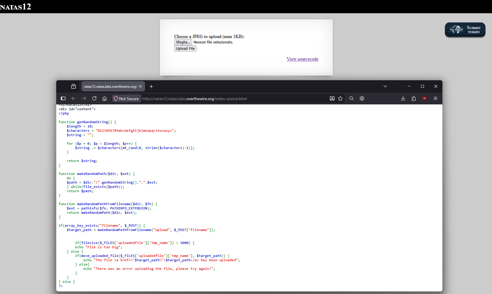
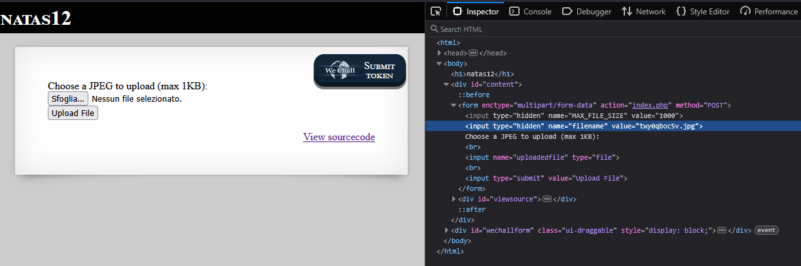
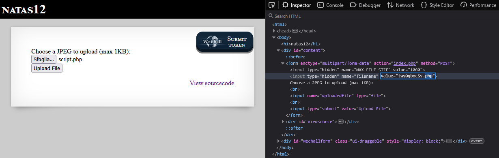
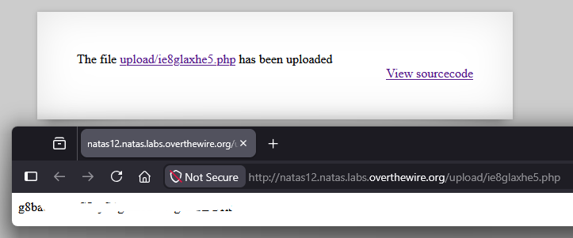

<!-- portfolio-desc: Upload di file con controllo debole su nome ed estensione: esecuzione di codice PHP sul server. -->

# Natas Level 12 → 13

## Obiettivo

La pagina permette di caricare un file JPEG di massimo 1KB. L'obiettivo è capire come il server gestisce il nome e l'estensione del file caricato, individuare l'eventuale debolezza nel controllo e sfruttarla per ottenere l'esecuzione di codice sul server.

---

## Informazioni di accesso

| Campo | Valore |
|-------|--------|
| URL | `http://natas12.natas.labs.overthewire.org` |
| Username | `natas12` |
| Password | *(password trovata al livello 11)* |

---

## Strumenti / concetti utili

- **Link "View sourcecode"** — espone il codice PHP della pagina
- **Inspector** (`F12`) — modifica di campi hidden del form prima dell'invio
- `pathinfo()` (PHP) — funzione che estrae informazioni da un percorso, incluso `PATHINFO_EXTENSION`
- `move_uploaded_file()` (PHP) — sposta un file caricato dalla posizione temporanea a quella di destinazione
- **Arbitrary File Upload → Remote Code Execution** — classe di vulnerabilità in cui l'assenza di controlli reali sul contenuto/estensione di un file caricato permette di piazzare ed eseguire codice sul server
- `file_get_contents()` (PHP) — funzione che legge l'intero contenuto di un file in una stringa

---

## Soluzione

### Step 1 – Lettura e analisi del sourcecode

Cliccando "View sourcecode" si legge il codice PHP che gestisce l'upload:

```php
function genRandomString() {
    $length = 10;
    $characters = "0123456789abcdefghijklmnopqrstuvwxyz";
    $string = "";

    for ($p = 0; $p < $length; $p++) {
        $string .= $characters[mt_rand(0, strlen($characters)-1)];
    }

    return $string;
}

function makeRandomPath($dir, $ext) {
    do {
        $path = $dir."/".genRandomString().".".$ext;
    } while(file_exists($path));
    return $path;
}

function makeRandomPathFromFilename($dir, $fn) {
    $ext = pathinfo($fn, PATHINFO_EXTENSION);
    return makeRandomPath($dir, $ext);
}

if(array_key_exists("filename", $_POST)) {
    $target_path = makeRandomPathFromFilename("upload", $_POST["filename"]);

    if(filesize($_FILES['uploadedfile']['tmp_name']) > 1000) {
        echo "File is too big";
    } else {
        if(move_uploaded_file($_FILES['uploadedfile']['tmp_name'], $target_path)) {
            echo "The file <a href=\"$target_path\">$target_path</a> has been uploaded";
        } else{
            echo "There was an error uploading the file, please try again!";
        }
    }
} else {
```

Si segue la catena di chiamate per capire da dove viene determinata l'estensione del file salvato sul server: `makeRandomPathFromFilename("upload", $_POST["filename"])` chiama `pathinfo($fn, PATHINFO_EXTENSION)` su `$fn`, che è il parametro ricevuto — cioè `$_POST["filename"]`. L'estensione del file finale non viene quindi letta dal file effettivamente caricato (`$_FILES['uploadedfile']`), ma da un campo POST separato chiamato `filename`.



### Step 2 – Individuare la vulnerabilità: l'estensione è controllata dal client

L'unico controllo effettivo nel codice sul file caricato è `filesize(...) > 1000`, che limita la dimensione a 1KB. Non c'è nessun controllo sul contenuto reale del file, sul suo MIME type o sulla sua estensione originale — l'estensione con cui il file viene salvato dipende esclusivamente dal valore del campo `filename` inviato nel form, che è un campo `hidden` e quindi liberamente modificabile lato client prima dell'invio.

Ispezionando il form si conferma la presenza del campo:

```html
<input type="hidden" name="filename" value="twy0qboc5v.jpg">
```

Il valore è una stringa generata casualmente lato server con estensione `.jpg` preimpostata. Se questo valore viene modificato in un'estensione `.php` prima dell'invio, e se la directory `upload/` esegue script PHP (comportamento di default su Apache con `mod_php`), un file caricato con contenuto PHP arbitrario verrebbe salvato con estensione eseguibile — un file che il server interpreta ed esegue quando richiesto via browser, indipendentemente dal fatto che il suo contenuto non sia affatto un'immagine JPEG.



### Step 3 – Preparazione dello script PHP da caricare

Si crea in locale un file `script.php` con un payload minimo, ben al di sotto del limite di 1000 byte, che legge ed espone il contenuto del file della password del livello successivo:

```php
<?php echo file_get_contents("/etc/natas_webpass/natas13"); ?>
```

`file_get_contents()` legge l'intero contenuto del file indicato e lo restituisce come stringa; `echo` lo stampa nell'output della pagina. Se lo script viene eseguito dal server con i permessi dell'utente che esegue Apache/PHP (lo stesso contesto sfruttato nei livelli precedenti per leggere `/etc/natas_webpass/`), il contenuto del file verrà mostrato nella risposta HTTP.

### Step 4 – Selezione del file e modifica del campo hidden

Si seleziona `script.php` tramite il pulsante "Sfoglia..." del form. Prima di cliccare "Upload File", si apre l'Inspector e si modifica manualmente il valore del campo hidden `filename`, sostituendo l'estensione `.jpg` con `.php`:

```html
<input type="hidden" name="filename" value="twy0qboc5v.php">
```

A questo punto il form è pronto per l'invio: il file effettivo caricato è `script.php` (contenuto PHP), mentre il campo che determina l'estensione di salvataggio sul server dichiara `.php`.



### Step 5 – Upload, esecuzione e password trovata

Cliccando "Upload File" il server salva il file in una posizione casuale dentro `upload/`, mantenendo l'estensione `.php` dichiarata nel campo hidden, e restituisce un link diretto al file caricato:

```
The file upload/ie8glaxhe5.php has been uploaded
```

Navigando a quel link, il server esegue lo script PHP appena caricato invece di limitarsi a servirlo come testo statico. L'output è il contenuto del file della password:

```
[REDACTED]
```



---

## Note e osservazioni

**Perché questa vulnerabilità è più seria dei livelli precedenti**

Nei livelli con LFI (level 7) o command injection (level 9, 10) si otteneva l'esecuzione o la lettura di qualcosa che già esisteva sul server, sfruttando una logica applicativa difettosa. Qui la vulnerabilità permette di **piazzare codice arbitrario proprio** e farlo eseguire dal server: non ci si limita a leggere risorse esistenti, ma si introduce ex novo uno script nel filesystem del server, che poi diventa parte della logica eseguita. Questa classe di vulnerabilità si chiama **Arbitrary File Upload** quando porta all'esecuzione di codice si parla di **Remote Code Execution (RCE)**, ed è generalmente considerata più critica delle vulnerabilità di sola lettura, perché non limita l'attaccante ai file leggibili dal server: qualsiasi azione che lo script caricato può compiere (leggere, scrivere, eseguire comandi) diventa disponibile.

**Perché il controllo sull'estensione era inefficace**

Il problema di fondo è la fonte del dato usato per decidere l'estensione: `pathinfo($_POST["filename"], PATHINFO_EXTENSION)` fida di un valore dichiarato dal client in un campo hidden, assumendo implicitamente che coincida con l'estensione del file realmente caricato. Un campo `hidden` in HTML non è "nascosto" nel senso di protetto: è semplicemente non visualizzato nell'interfaccia utente di default, ma resta un campo di form completamente accessibile e modificabile tramite gli strumenti di sviluppo del browser, esattamente come qualsiasi altro input. Fidarsi di un dato lato client per decisioni di sicurezza lato server è lo stesso errore concettuale già visto con Referer (level 4) e cookie (level 5): qualunque valore proveniente dal client va trattato come non attendibile finché non è validato lato server contro il dato reale (qui, il contenuto o il tipo MIME effettivo del file caricato, non un'etichetta dichiarata a parte).

**Perché il limite di dimensione non ha protetto nulla**

Il controllo `filesize(...) > 1000` limita solo la dimensione del file, non il suo contenuto o tipo. Uno script PHP funzionale può essere lungo poche decine di byte — il payload usato in questo livello ne occupa circa 50 — quindi il limite di 1KB non rappresenta alcun ostacolo per un attacco di questo tipo.
