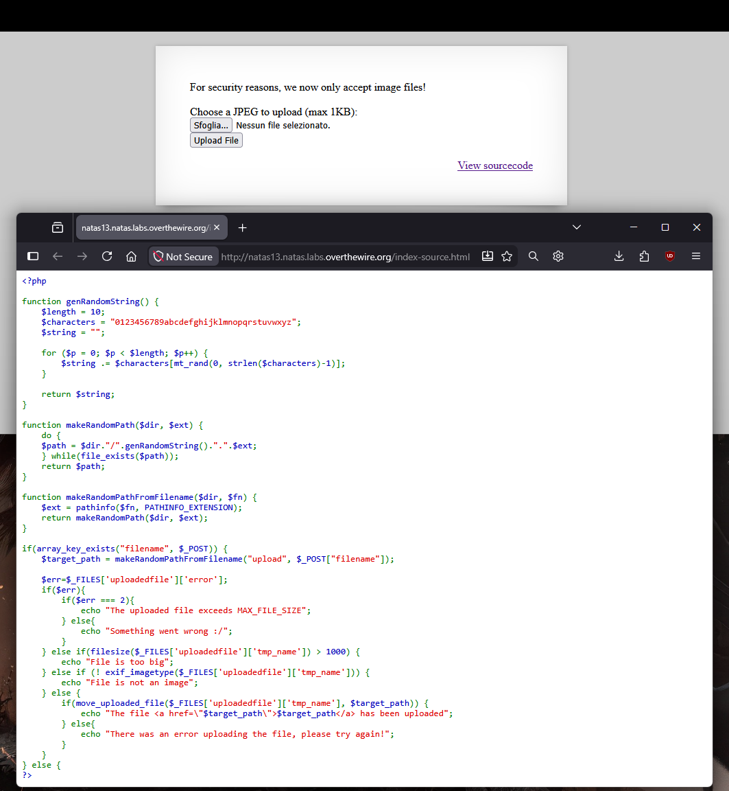
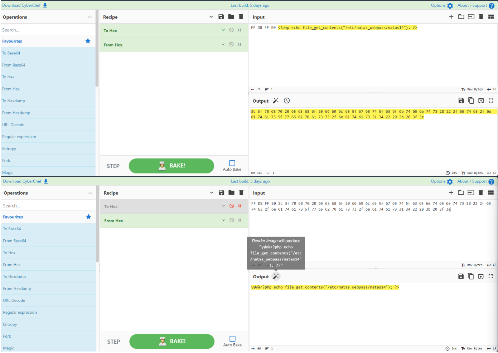
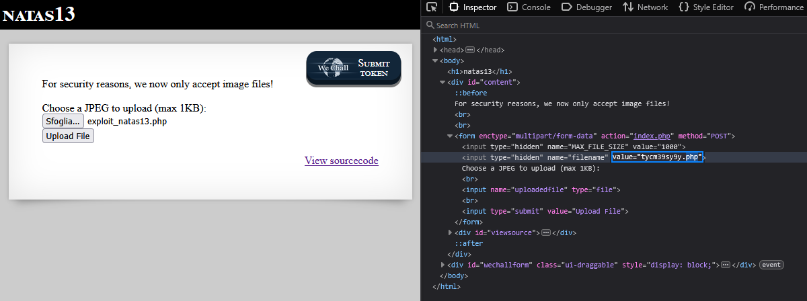
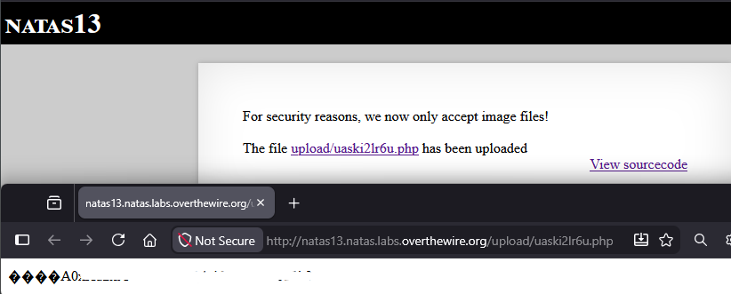

<!-- portfolio-desc: Bypass del controllo sul contenuto del file in un upload per l'esecuzione di codice PHP. -->

# Natas Level 13 → 14

## Obiettivo

Il form di upload è identico al livello precedente, ma il messaggio "For security reasons, we now only accept image files!" indica che è stato aggiunto un controllo sul contenuto del file caricato. L'obiettivo è analizzare in cosa consiste questo controllo, capire se e come può essere aggirato, e ottenere di nuovo l'esecuzione di codice PHP sul server.

---

## Informazioni di accesso

| Campo | Valore |
|-------|--------|
| URL | `http://natas13.natas.labs.overthewire.org` |
| Username | `natas13` |
| Password | *(password trovata al livello 12)* |

---

## Strumenti / concetti utili

- **Link "View sourcecode"** — espone il codice PHP della pagina
- **Inspector** (`F12`) — modifica del campo hidden `filename`, come nel livello 12
- `exif_imagetype()` (PHP) — determina il tipo di un'immagine leggendo i byte iniziali del file (i cosiddetti *magic bytes* o *file signature*), non l'intero contenuto
- **Magic bytes / file signature** — sequenza di byte all'inizio di un file che ne identifica il formato (es. `FF D8 FF E0` per JPEG/JFIF)
- **File polyglot** — file valido contemporaneamente in più formati diversi, perché ciascun parser/interprete coinvolto ne legge solo la parte che gli interessa
- **CyberChef** — strumento web per la manipolazione di dati, con operazioni come `To Hex` (converte byte in rappresentazione esadecimale) e `From Hex` (converte una stringa esadecimale in byte grezzi)

---

## Soluzione

### Step 1 – Lettura del sourcecode e confronto con il livello precedente

Il codice PHP di questo livello:

```php
function genRandomString() {
    $length = 10;
    $characters = "0123456789abcdefghijklmnopqrstuvwxyz";
    $string = "";

    for ($p = 0; $p < $length; $p++) {
        $string .= $characters[mt_rand(0, strlen($characters)-1)];
    }

    return $string;
}

function makeRandomPath($dir, $ext) {
    do {
        $path = $dir."/".genRandomString().".".$ext;
    } while(file_exists($path));
    return $path;
}

function makeRandomPathFromFilename($dir, $fn) {
    $ext = pathinfo($fn, PATHINFO_EXTENSION);
    return makeRandomPath($dir, $ext);
}

if(array_key_exists("filename", $_POST)) {
    $target_path = makeRandomPathFromFilename("upload", $_POST["filename"]);

    $err=$_FILES['uploadedfile']['error'];
    if($err){
        if($err === 2){
            echo "The uploaded file exceeds MAX_FILE_SIZE";
        } else{
            echo "Something went wrong :/";
        }
    } else if (filesize($_FILES['uploadedfile']['tmp_name']) > 1000) {
        echo "File is too big";
    } else if (! exif_imagetype($_FILES['uploadedfile']['tmp_name'])) {
        echo "File is not an image";
    } else {
        if(move_uploaded_file($_FILES['uploadedfile']['tmp_name'], $target_path)) {
            echo "The file <a href=\"$target_path\">$target_path</a> has been uploaded";
        } else{
            echo "There was an error uploading the file, please try again!";
        }
    }
} else {
?>
```

Confrontando con il livello 12, due cose sono rilevanti. Primo: la riga `$target_path = makeRandomPathFromFilename("upload", $_POST["filename"]);` è identica — l'estensione del file salvato continua a dipendere dal campo hidden `filename`, non dal file realmente caricato. La vulnerabilità del livello 12 **non è stata corretta**. Secondo: è stata aggiunta una nuova condizione, `! exif_imagetype($_FILES['uploadedfile']['tmp_name'])`, che rigetta l'upload stampando "File is not an image" se il controllo fallisce. Questo è l'unico cambiamento rispetto al livello precedente, ed è quindi l'unico ostacolo nuovo da superare.



### Step 2 – Capire i limiti di `exif_imagetype()` e individuare la debolezza residua

`exif_imagetype()` determina il tipo di un'immagine leggendo i suoi **magic bytes**: pochi byte all'inizio del file che, per convenzione, identificano il formato. Un file JPEG in formato JFIF inizia sempre con la sequenza `FF D8 FF E0`. La funzione confronta questi byte iniziali con le firme note (JPEG, PNG, GIF, ecc.) e restituisce il tipo corrispondente se trova una corrispondenza — o `false` altrimenti. Il punto centrale è che **la funzione legge solo l'intestazione**: non analizza né valida la struttura dell'intero file.

Questo si combina con un comportamento già osservato indirettamente nei livelli precedenti riguardo all'esecuzione PHP: quando il server esegue un file `.php`, l'interprete PHP non richiede che il file inizi con `<?php` — scansiona l'intero contenuto alla ricerca di blocchi `<?php ... ?>` ovunque si trovino, eseguendo solo ciò che sta al loro interno e trattando tutto il resto come output letterale, esattamente come farebbe con testo HTML statico.

Mettendo insieme questi due fatti: se un file inizia con byte che soddisfano `exif_imagetype()` come JPEG valido, e in un punto qualsiasi dello stesso file è presente un blocco `<?php ... ?>`, il file supera il controllo di upload **e** viene eseguito correttamente come script PHP una volta salvato con estensione `.php` — estensione ancora controllata dal campo hidden `filename`, come nel livello 12. Un file di questo tipo, valido contemporaneamente come immagine (per chi ne legge solo l'intestazione) e come script PHP (per l'interprete, che legge tutto il file), si chiama **file polyglot**.

### Step 3 – Costruzione del file ibrido con CyberChef

Il payload PHP è lo stesso concetto del livello 12, adattato al file di questo livello:

```php
<?php echo file_get_contents("/etc/natas_webpass/natas14"); ?>
```

Per costruire il file si usa **CyberChef**, uno strumento web per la manipolazione di dati organizzato in "operazioni" componibili in una "recipe". Il principio è: comporre l'intero contenuto binario del file finale come un'unica sequenza — i magic bytes della firma JPEG (`FF D8 FF E0`) seguiti dal codice PHP del payload — e usare l'operazione `From Hex` per convertire quella sequenza esadecimale in byte grezzi, producendo il file binario effettivo da salvare e caricare. Il risultato è un file che inizia con un'intestazione JPEG valida e prosegue con codice PHP eseguibile per intero.



### Step 4 – Selezione del file e modifica del campo hidden `filename`

Il file binario prodotto (es. `exploit_natas13.php`) si seleziona tramite "Sfoglia..." nel form di upload. Come nel livello 12, si apre l'Inspector e si modifica il valore del campo hidden `filename`, sostituendo l'estensione generata di default con `.php`:

```html
<input type="hidden" name="filename" value="tycm39sy9y.php">
```



### Step 5 – Upload, esecuzione e password trovata

Il file supera ora entrambi i controlli attivi: la dimensione è sotto 1KB e `exif_imagetype()` riconosce l'intestazione JPEG come valida. Il server lo salva con estensione `.php`:

```
The file upload/uaski2lr6u.php has been uploaded
```

Navigando al link, il server esegue il file come script PHP. L'output mostra alcuni caratteri non validi all'inizio — i byte grezzi della firma JPEG, che non corrispondono a testo leggibile e vengono mostrati dal browser come caratteri di sostituzione — seguiti dall'output effettivo dello script, cioè la password:

```
[byte non validi]
[REDACTED]
```



---

## Note e osservazioni

**Perché i caratteri illeggibili prima della password**

I quattro byte `FF D8 FF E0` non corrispondono a caratteri di testo validi in nessuna codifica comune (UTF-8 compreso): sono dati binari, parte della firma JPEG. Quando il browser riceve la risposta HTTP e prova a renderizzarla come testo, quei byte vengono mostrati come simboli di sostituzione. Sono presenti perché si trovano **fuori** da qualsiasi blocco `<?php ... ?>`: PHP li tratta come output letterale, li stampa così come sono, esattamente come farebbe con testo HTML scritto fuori dai tag PHP. Solo il contenuto dentro `<?php ... ?>` viene interpretato ed eseguito — in questo caso, la chiamata a `file_get_contents()` che stampa la password.

**La lezione principale: patchare un sintomo non elimina la causa**

Questo livello è la dimostrazione diretta di un principio di sicurezza: aggiungere un controllo puntuale (qui, `exif_imagetype()`) senza rimuovere la causa strutturale del problema (l'estensione del file determinata da un valore client-controlled) lascia il sistema ancora vulnerabile, semplicemente alzando la barriera tecnica per sfruttarlo. Il controllo sul tipo di immagine impedisce di caricare uno script PHP puro come nel livello 12, ma non impedisce di caricare un file che è *anche* un'immagine valida secondo lo stesso controllo. La causa radice — fidarsi di un dato dichiarato dal client per decidere come il server tratterà il file — resta intatta.

**Perché `exif_imagetype()` da solo non è un controllo sufficiente**

Verificare solo l'intestazione di un file è un controllo debole per due motivi distinti: primo, come mostrato in questo livello, non impedisce che il resto del file contenga qualcos'altro; secondo, anche accettando solo file con intestazione immagine valida, il problema di fondo rimane l'esecuzione di quel file come script — se la cartella di upload non permettesse l'esecuzione di PHP, il contenuto del file (qualunque esso sia) non avrebbe alcun effetto, indipendentemente da cosa contiene oltre l'intestazione.

**Altri strumenti che avrebbero permesso di costruire lo stesso file**

CyberChef non è l'unico modo per creare un file binario che inizi con byte arbitrari seguiti da testo: qualsiasi strumento in grado di scrivere byte grezzi in un file funziona allo stesso modo. Due alternative comuni:

- **Un hex editor** (ad esempio HxD su Windows, o GHex/Bless su Linux): permette di aprire o creare un file e scriverne il contenuto byte per byte in visualizzazione esadecimale, inserendo manualmente `FF D8 FF E0` seguiti dal testo del payload PHP.
- **Uno script Python**: aprendo un file in modalità binaria (`"wb"`) è possibile scrivere direttamente la sequenza di byte magici seguita dal payload PHP codificato come byte, in poche righe di codice, senza passare da un'interfaccia grafica.

**Prevenzione corretta**

Una soluzione robusta a questo tipo di attacco richiede più livelli combinati: validare il tipo di file basandosi su un'analisi più approfondita del contenuto (non solo i primi byte), impedire l'esecuzione di script nella cartella di upload (ad esempio tramite configurazione del server o spostando gli upload fuori dalla document root), e — soprattutto — non derivare mai l'estensione con cui un file viene salvato da un valore dichiarato dal client, ma dal tipo di contenuto effettivamente verificato lato server.
