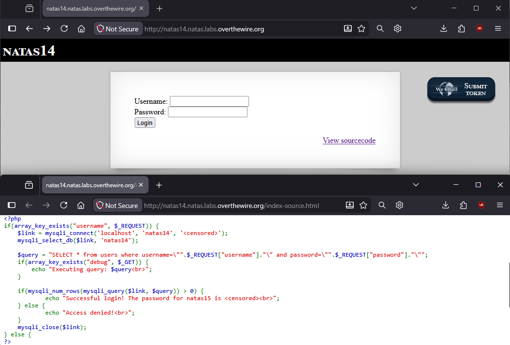
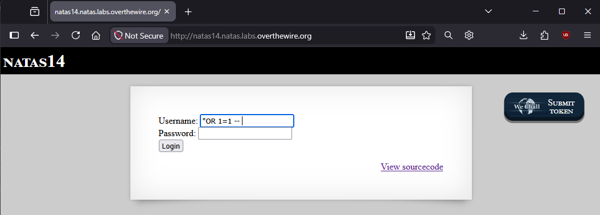
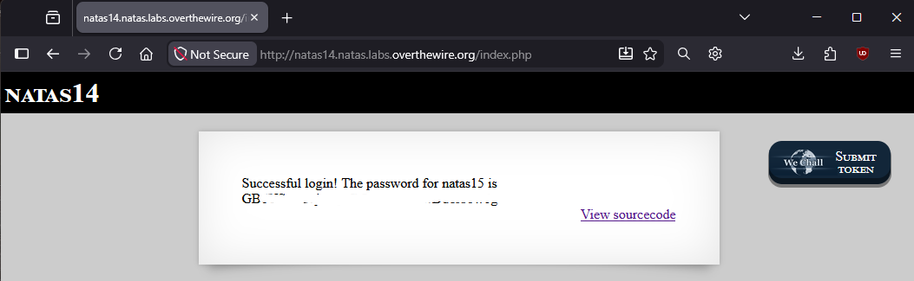

<!-- portfolio-desc: SQL injection nel form di login per bypassare l'autenticazione senza credenziali valide. -->

# Natas Level 14 → 15

## Obiettivo

La pagina presenta un form di login classico con username e password. L'obiettivo è analizzare come il server costruisce la query di verifica delle credenziali e sfruttarne la costruzione per autenticarsi senza conoscere username o password validi.

---

## Informazioni di accesso

| Campo | Valore |
|-------|--------|
| URL | `http://natas14.natas.labs.overthewire.org` |
| Username | `natas14` |
| Password | *(password trovata al livello 13)* |

---

## Strumenti / concetti utili

- **Link "View sourcecode"** — espone il codice PHP della pagina
- `mysqli_connect` / `mysqli_query` — funzioni PHP per connettersi a un database MySQL ed eseguire query
- **SQL injection** — vulnerabilità che si verifica quando input controllato dall'utente viene concatenato senza sanitizzazione in una query SQL, alterandone la logica
- `--` — sintassi di commento in SQL: tutto ciò che segue sulla stessa riga viene ignorato dal motore di query
- `OR 1=1` — condizione booleana sempre vera, usata per forzare un `WHERE` a restituire tutte le righe

---

## Soluzione

### Step 1 – Lettura e analisi del sourcecode

Cliccando "View sourcecode" si legge il codice PHP che gestisce il login:

```php
<?php
if(array_key_exists("username", $_REQUEST)) {
    $link = mysqli_connect('localhost', 'natas14', '<censored>');
    mysqli_select_db($link, 'natas14');

    $query = "SELECT * from users where username=\"".$_REQUEST["username"]."\" and password=\"".$_REQUEST["password"]."\"";
    if(array_key_exists("debug", $_GET)) {
        echo "Executing query: $query<br>";
    }

    if(mysqli_num_rows(mysqli_query($link, $query)) > 0) {
            echo "Successful login! The password for natas15 is <censored><br>";
    } else {
            echo "Access denied!<br>";
    }
    mysqli_close($link);
} else {
?>
```

Il punto critico è la costruzione della query:

```php
$query = "SELECT * from users where username=\"".$_REQUEST["username"]."\" and password=\"".$_REQUEST["password"]."\"";
```

I valori di `username` e `password` inviati dal form vengono inseriti direttamente nella stringa SQL tramite concatenazione, racchiusi tra virgolette doppie, senza nessuna funzione di escaping (come `mysqli_real_escape_string()`) o l'uso di query parametrizzate. Se l'utente riesce a inserire un carattere `"` nel proprio input, può "chiudere" la stringa prevista dal server e aggiungere codice SQL arbitrario che verrà interpretato come parte della query.



### Step 2 – Costruire l'input malevolo

L'obiettivo è far sì che la condizione `WHERE` della query risulti sempre vera, indipendentemente da username e password reali. Si inserisce nel campo Username:

```
"OR 1=1 -- 
```

(il valore termina con due trattini seguiti da uno spazio)



Per capire perché questo funziona, si ricostruisce la query risultante sostituendo il valore nel template PHP. Il codice produce letteralmente la stringa:

```
SELECT * from users where username="
```

seguita dal valore inserito, seguita da:

```
" and password="
```

seguita dal valore di password (vuoto), seguita da `"`. Concatenando tutto:

```sql
SELECT * from users where username=""OR 1=1 -- " and password=""
```

Analizzando questa stringa come SQL: `username=""` è una stringa vuota confrontata con username (falso in genere), subito dopo `OR 1=1` introduce una condizione sempre vera in OR con la precedente. Da qui in poi, `-- ` (due trattini seguiti da uno spazio, sintassi di commento richiesta da MySQL) fa sì che tutto il resto della riga — cioè `" and password=""` — venga ignorato dal motore SQL, invece di essere interpretato come SQL.

La query effettivamente eseguita si riduce quindi a:

```sql
SELECT * from users where username="" OR 1=1
```

Poiché `1=1` è sempre vero, la clausola `WHERE` risulta vera per ogni riga della tabella `users`, indipendentemente da username o password. La query restituisce tutte le righe della tabella.

### Step 3 – Login e password trovata

Con il campo Password lasciato vuoto, si clicca "Login". Il server esegue la query, `mysqli_num_rows()` restituisce un numero maggiore di zero (la tabella ha almeno una riga), e la condizione `if(mysqli_num_rows(...) > 0)` risulta vera:

```
Successful login! The password for natas15 is [REDACTED]
```



---

## Note e osservazioni

**Cos'è la SQL injection**

La SQL injection è una delle vulnerabilità web più note e si verifica quando un'applicazione costruisce una query SQL concatenando direttamente stringhe con input fornito dall'utente, senza separare in modo sicuro il codice SQL (fisso, scritto dallo sviluppatore) dai dati (variabili, forniti dall'utente). Se l'input contiene caratteri con significato speciale in SQL — apici, virgolette, `--`, `;` — questi vengono interpretati dal motore di database come parte della query stessa, permettendo di alterarne la logica, come dimostrato in questo livello con il bypass dell'autenticazione. Nei casi più gravi, la SQL injection permette anche di leggere dati arbitrari dal database, modificarli o eliminarli. Questa classe di vulnerabilità è classificata come **CWE-89** (*Improper Neutralization of Special Elements used in an SQL Command*).

**Perché `-- ` richiede lo spazio finale**

In MySQL, la sintassi di commento a singola riga `--` richiede che sia seguita da almeno un carattere di spazio (o un altro carattere di whitespace) per essere riconosciuta come inizio di commento. Un semplice `--` senza nulla dopo, a fine stringa, potrebbe non essere interpretato correttamente in tutte le situazioni; per questo l'input usato in questo livello include esplicitamente uno spazio dopo i due trattini.

**Il parametro `debug` visibile nel sourcecode**

Il codice PHP di questo livello contiene una funzionalità di debug non collegata a nessun elemento visibile dell'interfaccia:

```php
if(array_key_exists("debug", $_GET)) {
    echo "Executing query: $query<br>";
}
```

Aggiungendo `?debug=1` (o qualsiasi valore) alla query string dell'URL, il server stampa nella pagina la query SQL esattamente come costruita, prima di eseguirla. Questo è un ottimo modo per verificare in modo diretto se il proprio input sta effettivamente alterando la struttura della query come previsto, senza dover indovinare dal solo comportamento osservato (successo o fallimento del login).

**Prevenzione corretta**

Il modo corretto per evitare SQL injection è non costruire mai query per concatenazione di stringhe con input dell'utente. Le **query parametrizzate** (dette anche *prepared statements*, disponibili in PHP tramite `mysqli_prepare()` / `mysqli_stmt_bind_param()` o l'estensione PDO) separano nettamente la struttura della query dai valori: i parametri vengono inviati al database separatamente dal testo SQL e non possono mai essere interpretati come codice, indipendentemente dal loro contenuto. Un secondo livello di difesa, meno robusto ma comunque utile, è l'escaping esplicito dei caratteri speciali tramite funzioni come `mysqli_real_escape_string()`.
