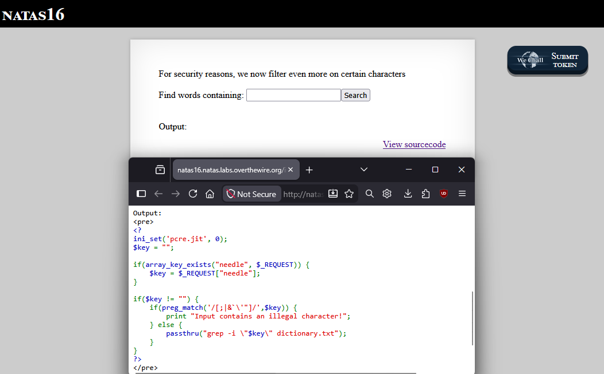
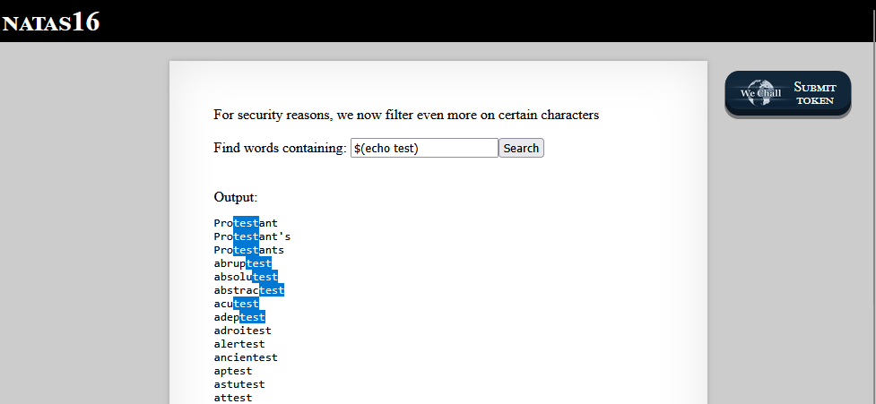
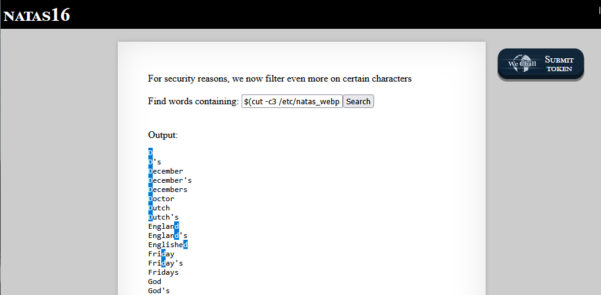
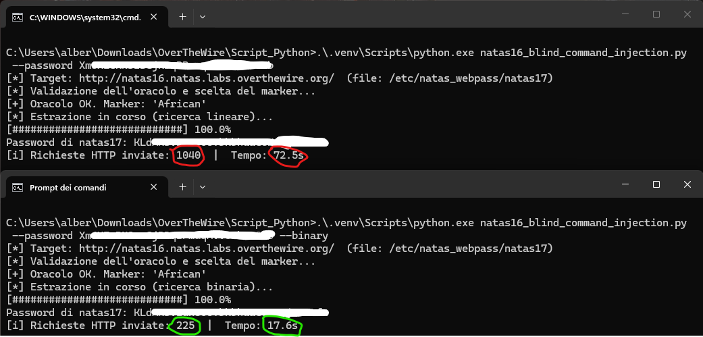

<!-- portfolio-desc: Blind OS command injection sotto blacklist: bypass con command substitution e oracolo booleano su grep. -->

# Natas Level 16 → 17

> **Script di risoluzione:** [`natas16_blind_command_injection.py`](https://github.com/gion-week/Natas-OverTheWire/blob/main/scripts/natas16_blind_command_injection.py) — automatizza la blind OS command injection (richiede `--password`; scansione lineare di default, `--binary` come ottimizzazione).

## Obiettivo

La pagina espone un form che cerca parole dentro un dizionario tramite `grep`, mostrando solo le righe che fanno match. L'input viene filtrato da una blacklist di caratteri. L'obiettivo è aggirare il filtro per iniettare un comando di shell e, poiché l'output del comando non è mai visibile direttamente, sfruttare le parole mostrate come **oracolo booleano** per estrarre un carattere alla volta la password dell'utente `natas17`, contenuta in `/etc/natas_webpass/natas17`.

---

## Informazioni di accesso

| Campo | Valore |
|-------|--------|
| URL | `http://natas16.natas.labs.overthewire.org` |
| Username | `natas16` |
| Password | *(password trovata al livello 15)* |

---

## Strumenti / concetti utili

- **Link "View sourcecode"** — espone il codice PHP della pagina
- **OS command injection** — input utente concatenato in un comando passato alla shell, che permette di eseguire comandi arbitrari
- **Blind command injection (boolean-based)** — variante in cui l'output del comando iniettato non è restituito: si osserva solo un segnale binario (vero/falso) dal comportamento della pagina
- **Command substitution `$(...)`** — costrutto della shell che sostituisce un comando con il suo output; valutato anche dentro le virgolette doppie
- **Blacklist vs whitelist** — un filtro che vieta *alcuni* caratteri invece di ammettere *solo* quelli sicuri
- `grep`, `grep -v`, `cut`, bracket expression `[...]`, quantificatore `.{n}` — usati per costruire l'oracolo e leggere il file bersaglio
- **Ricerca lineare / ricerca binaria** — strategie per ricostruire la password (la seconda dimezza lo spazio dei candidati a ogni richiesta)
- Python (`requests`, `HTTPBasicAuth`) — libreria per automatizzare centinaia di richieste HTTP in sequenza

---

## Soluzione

### Step 1 – Lettura del sourcecode: command injection sotto filtro

Il sourcecode mostra come viene gestito l'input del form:

```php
<?
ini_set('pcre.jit', 0);
$key = "";

if(array_key_exists("needle", $_REQUEST)) {
    $key = $_REQUEST["needle"];
}

if($key != "") {
    if(preg_match('/[;|&`\'"]/',$key)) {
        print "Input contains an illegal character!";
    } else {
        passthru("grep -i \"$key\" dictionary.txt");
    }
}
?>
```

Il parametro `needle` (`$key`) viene concatenato senza sanificazione dentro le virgolette doppie di un comando passato a `passthru`, cioè eseguito da una shell: è una **OS command injection**. La difesa è una blacklist: `preg_match('/[;|&`\'"]/',$key)` rifiuta l'input se contiene uno tra i caratteri `;` `|` `&` `` ` `` `'` `"`.

Il ragionamento chiave è capire *cosa* blocca la blacklist e *cosa dimentica*. I caratteri vietati chiudono le vie più ovvie: `"` per uscire dalle virgolette, `` ` `` per la command substitution con i backtick, `;` `|` `&` per concatenare o mettere in pipe altri comandi, `'` per gli apici singoli. Ma tra i caratteri controllati **mancano `$`, `(` e `)`**: la command substitution nella forma `$(...)` non è bloccata, e la shell la valuta anche all'interno delle virgolette doppie in cui finisce `$key`. È l'apertura da sfruttare.



### Step 2 – Conferma della command substitution

Per verificare l'ipotesi si inserisce nel form `$(echo test)`. L'input supera il controllo caratteri (non contiene nessun carattere della blacklist) e la pagina mostra tutte le parole del dizionario che contengono "test":

```
$(echo test)
```

Il risultato conferma due cose in un colpo solo: la substitution viene **eseguita** dalla shell, e il suo output (`test`) diventa il pattern con cui `grep` cerca nel dizionario. Da qui in poi il pattern di ricerca mostrato dalla pagina non è più un testo scelto dall'utente, ma l'**output di un comando** che decidiamo noi.



### Step 3 – Leggere il bersaglio, ma non il case

Il passo successivo punta direttamente al file con la password di `natas17`. Con `cut` si isola un singolo carattere del file e lo si dà in pasto a `grep`:

```
$(cut -c3 /etc/natas_webpass/natas17)
```

`cut -c3` estrae il terzo carattere della password: la pagina mostra tutte le parole che lo contengono, e osservando quali lettere sono evidenziate si deduce che il terzo carattere è una **"d"**.

Qui però emerge il limite di questo approccio diretto. Il `grep` della pagina è invocato con `-i` (case-insensitive): le parole evidenziate contengono indistintamente `d` e `D`, quindi non è possibile stabilire se il carattere della password è minuscolo o maiuscolo. Inoltre leggere il carattere "a occhio" dalle parole evidenziate non è né automatizzabile né affidabile. Serve un modo per produrre un **output controllato** che risponda a una domanda booleana precisa ("il carattere in posizione *i* è esattamente *c*?") in modo case-sensitive.



### Step 4 – Costruire l'oracolo booleano e automatizzarlo

L'idea è confrontare il carattere in una data posizione con ogni candidato di `[0-9A-Za-z]` in modo che la pagina risponda in maniera netta: output presente = vero, output assente = falso. La costruzione che realizza questo, dato un candidato `c` e una posizione `i` (1-based), è:

```
$(grep -vE ^.{i-1}c /etc/natas_webpass/natas17)
```

che la pagina esegue come:

```
grep -i "$(grep -vE ^.{i-1}c /etc/natas_webpass/natas17)" dictionary.txt
```

Il `grep` interno è **case-sensitive** (senza `-i`), il che risolve proprio l'ambiguità dello Step 3: `^.{i-1}c` salta i primi `i-1` caratteri e verifica che il carattere in posizione *i* sia esattamente `c`, distinguendo maiuscole da minuscole. Il file bersaglio contiene una sola riga (la password), quindi:

- se il carattere **combacia** → `grep -v` esclude l'unica riga → l'output interno è vuoto → il pattern esterno diventa `""` → `grep -i ""` matcha **tutte** le parole → output pieno = **VERO**;
- se **non** combacia → `grep -v` stampa la password → il pattern esterno è la password di 32 caratteri, che nessuna parola del dizionario contiene → output vuoto = **FALSO**.

Nessuno dei caratteri usati (`$ ( ) { } . ^ -` e lo spazio) è nella blacklist, quindi il payload passa il filtro. Per non scaricare l'intero dizionario a ogni risposta vera, lo script appende al payload un *marker* — una parola pescata a runtime dal dizionario (nello screenshot dello step successivo è `African`): su VERO la pagina stampa solo le poche parole che lo contengono, mantenendo identico il criterio (output non vuoto = vero) ma riducendo drasticamente la banda.

Questo mattone elementare va ripetuto per ogni posizione e ogni candidato: un lavoro impraticabile a mano, che lo script scritto con l'assistenza di **Claude Code** (Opus 4.8) automatizza. Il cuore è la traduzione dell'oracolo in un singolo `True`/`False`:

```python
def char_matches(self, pos, c):
    needle = f"$(grep -vE ^.{{{pos - 1}}}{c} {self.target_file}){self.marker}"
    return bool(self._pre(needle).strip())
```

sopra cui la scansione lineare prova i candidati finché uno risponde vero:

```python
def find_char_linear(oracle, pos, charset):
    for c in charset:
        if oracle.char_matches(pos, c):
            return c
    return None
```

Prima di partire, lo script esegue un **self-test** del classificatore che non dipende dal segreto: `$(echo)` deve dare output pieno (controllo VERO) e una stringa inesistente nel dizionario deve dare output vuoto (controllo FALSO). Serve a scoprire subito un eventuale problema di configurazione, non a metà estrazione.

### Step 5 – Esecuzione dello script e password trovata

Lo script viene eseguito da riga di comando passando la password del livello. Lo stesso screenshot mostra **due esecuzioni affiancate** — la scansione lineare di default e la variante `--binary` — così da confrontare visivamente la velocità dei due metodi (la ricerca binaria è discussa nelle note): la prima completa l'estrazione in **1040 richieste** e circa 72 secondi, la seconda nello stesso risultato con **225 richieste** e circa 18 secondi. In entrambi i casi l'output ricostruisce la password di `natas17`:

```
C:\Users\alber\Downloads\OverTheWire\Script_Python>.\.venv\Scripts\python.exe natas16_blind_command_injection.py --password [REDACTED]
[*] Target: http://natas16.natas.labs.overthewire.org/  (file: /etc/natas_webpass/natas17)
[*] Validazione dell'oracolo e scelta del marker...
[+] Oracolo OK. Marker: 'African'
[*] Estrazione in corso (ricerca lineare)...
[############################] 100.0%
Password di natas17: [REDACTED]
[i] Richieste HTTP inviate: 1040  |  Tempo: 72.5s
```

La password di `natas17` è stata quindi ricostruita interamente sfruttando solo la presenza o assenza di parole nell'output di `grep`, un bit di informazione per richiesta.



---

## Note e osservazioni

**Perché questa è "blind" — l'analogia con il livello 15**

Come nel livello 15, la vulnerabilità non restituisce mai il dato cercato: lì una query SQL esponeva solo "l'utente esiste / non esiste", qui un comando di shell espone solo le parole del dizionario che fanno match. In entrambi i casi il canale d'osservazione si riduce a un singolo bit per richiesta, e in entrambi i casi ciò non rende la falla meno grave — solo più lenta da sfruttare. Cambia la natura dell'iniezione (SQL contro comando di sistema operativo), ma la tecnica di estrazione — costruire un oracolo booleano e interrogarlo carattere per carattere — è la stessa.

**Il nodo del case, risolto spostando il confronto**

Lo Step 3 mostra il problema centrale del livello: il `grep -i` della pagina è case-insensitive, quindi leggere direttamente un carattere del file non permette di distinguere `d` da `D`. La soluzione non è aggirare quel `grep`, ma **incapsularne un secondo, case-sensitive**, dentro la command substitution (`grep -vE` senza `-i`): il confronto sul case avviene nel comando interno, mentre quello esterno serve solo a trasformare "riga esclusa / riga stampata" in "dizionario intero / niente". È lo stesso tipo di ragionamento del livello 15, dove si usava `ASCII()` invece del confronto diretto tra stringhe proprio per ottenere un confronto case-sensitive.

**Miglioria aggiunta dopo: la ricerca binaria (`--binary`)**

La prima versione dello script usa la scansione lineare descritta allo Step 4: per ogni posizione prova i candidati uno per uno, fino a 62 richieste per carattere, per un totale di circa 1040 richieste. Una volta funzionante, è stata aggiunta come ottimizzazione la modalità `--binary`. L'idea è sostituire il test di uguaglianza (`^.{i-1}c`, un solo carattere) con un test di **appartenenza a un insieme** tramite una bracket expression:

```
$(grep -vE ^.{i-1}[SOTTOINSIEME] /etc/natas_webpass/natas17)MARKER
```

che è vero se il carattere in posizione *i* è uno qualsiasi di quelli nel sottoinsieme. A quel punto si dimezza ripetutamente il charset — "il carattere sta nella prima metà?" — riducendo le richieste da fino a 62 a circa `log2(62) ≈ 6` per posizione. Il risultato è il salto visibile nello screenshot dello Step 5: **da ~1040 a ~225 richieste** (da ~72 a ~18 secondi), a parità di vulnerabilità e di oracolo — cambia solo il *modo* di interrogarlo. La classe `[...]` è sicura perché il charset è alfanumerico (nessun carattere speciale come `]`, `^`, `-` all'interno delle parentesi); l'unico dubbio, la possibilità che la shell interpreti `[...]` come glob, è stato verificato sul server: un glob che non combacia con alcun file viene passato letteralmente a `grep`, quindi il test funziona.

Vale la nota già fatta al livello 15: un assistente come Claude Code comprime i tempi di *scrittura* dello strumento, ma il vantaggio esiste solo se si comprende ogni scelta dell'oracolo (perché `grep -v`, perché il `grep` interno senza `-i`, perché il marker, perché la bracket è sicura) — comprensione che resta il prerequisito per verificare, correggere e adattare lo script, non un passaggio opzionale.

**Prevenzione corretta**

La radice del problema è passare input dell'utente a una shell. La blacklist di questo livello dimostra la fragilità dell'approccio: basta dimenticare `$()` per vanificarla. Le contromisure corrette sono, in ordine di preferenza: non invocare affatto una shell (usare API che ricevono argomenti come lista, senza interpretazione); se un comando esterno è indispensabile, passare gli argomenti già neutralizzati con `escapeshellarg()`; e in generale preferire una whitelist rigorosa (ad esempio, per un campo che cerca parole, ammettere solo caratteri alfabetici) invece di elencare i caratteri da vietare.
